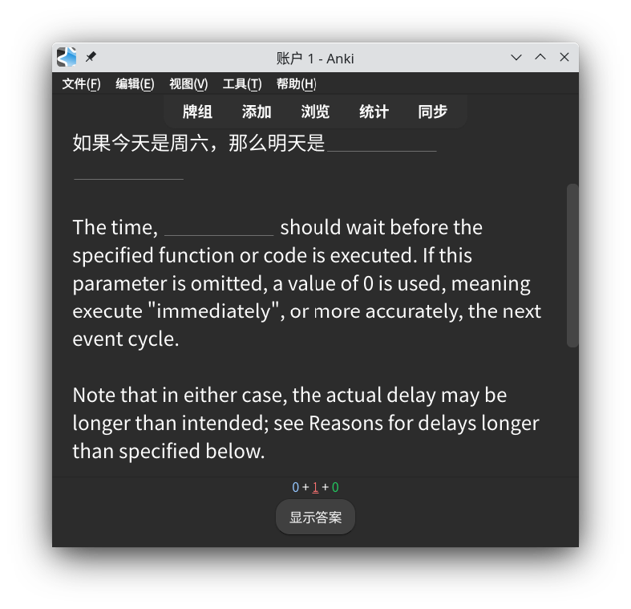
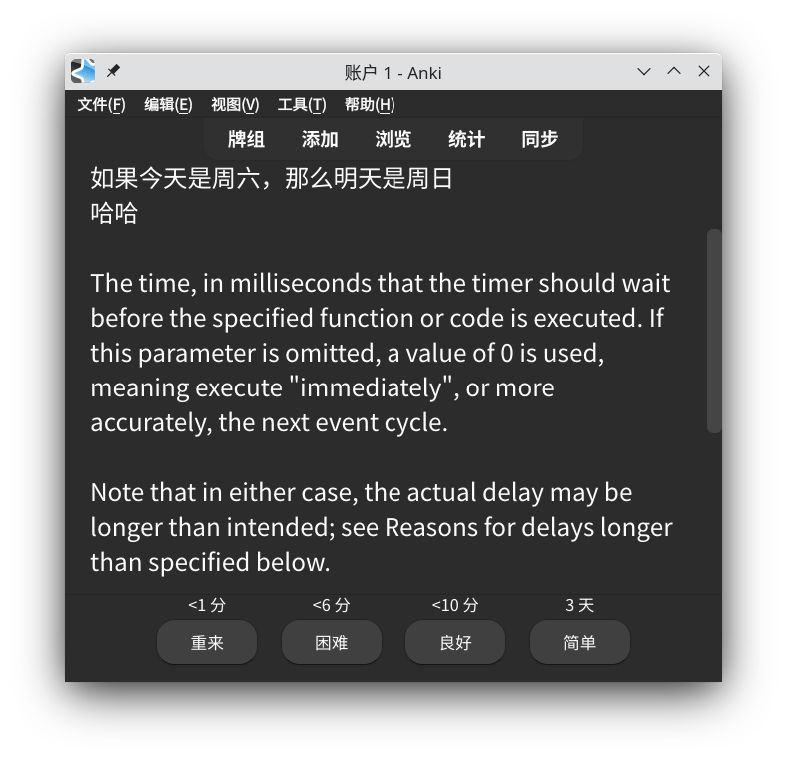

# 说明

一个简单的填空题模板，特点：点击下划线后，下划线消失；再次点击，下划线出现。各个填空互不干涉，可单独点击。

|图1|图2|
|--|--|
|||

基于[Kevin-Anki-Templates](https://github.com/kevin2li/Kevin-Anki-Templates)的填空题JS逻辑修改

卡片字段

- `content`问题（含答案），其中需要填空的部份，用`[[`和`]]`括起来
- `notes`附注，可选字段

# 按键选中

支持`Ctrl+Alt+1`和`Ctrl+Alt+2`快捷键，进行填空答案的翻看与隐藏。设置该快捷键的目的在于外接一个自定义蓝牙键盘，无线答题。

支持`Ctrl+Alt+3`和`Ctrl+Alt+4`快捷键，选中上个或下个填空，方便在各个填空之间来回游走。

# 单元测试

```bash
nvm use 22
node test.js
```
