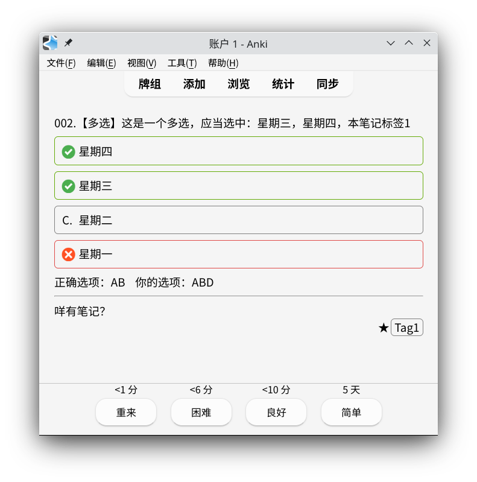
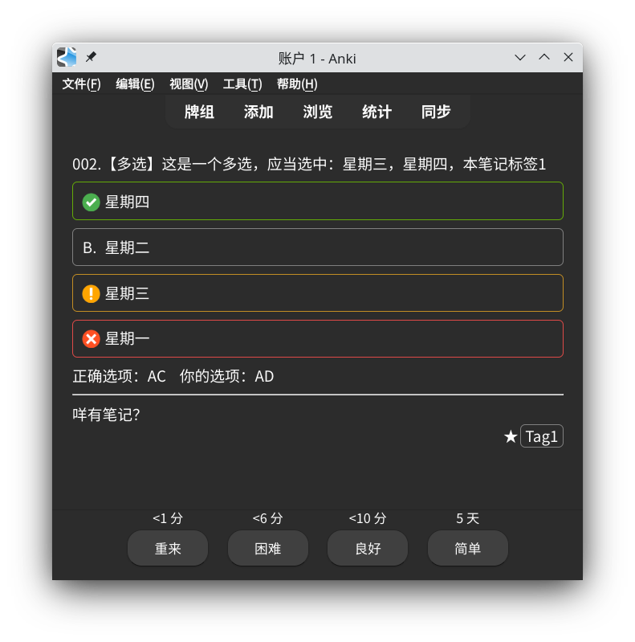

# 说明

基于[anki-awesome-select](https://github.com/git9527/anki-awesome-select)的CSS样式修改

|亮色主题|暗色主题|
|--|--|
|||

卡片字段

- `id`排序的主键，建议采用不重复的数字
- `question`问题，如`以下选项正确的是？`
- `options`选项，以回车换行分割，每行以字母开头，如

```
A.第一项
B.第二项
C.第三项
D.第四项
```

- `answer`答案，如`ACD`，注意必须与`options`的选项对应，如在答案前加上`?`表示不定项（即正确选项个数至少1个）
- `notes`附注，可选字段
- `reference`来源，可选字段，用于指示题目第几题，如`2025年卷第10题`

# 编译

```bash
bash release.sh
```

在`dist`目录找到三个文件即为所需。

# 单元测试

```bash
nvm use 22
node test.js
```
