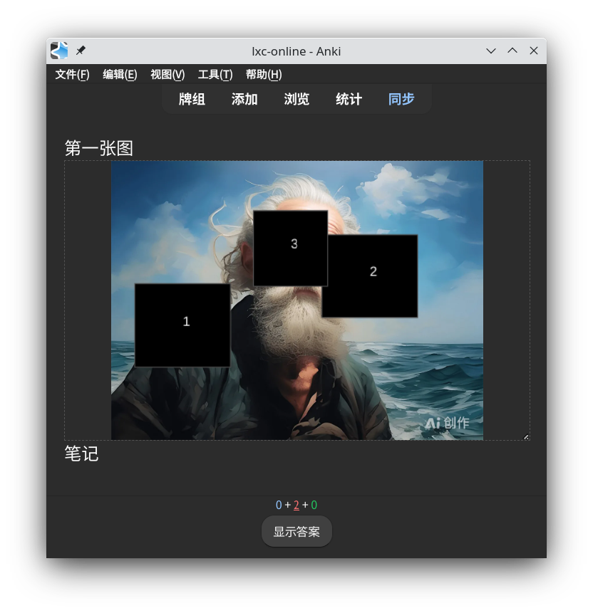

# 说明

一个简单的图片遮罩模板，特点：点击后黑方框遮罩消失，再次点击显示遮罩。各个遮罩互不干涉，可单独点击。



基于[Kevin-Anki-Templates](https://github.com/kevin2li/Kevin-Anki-Templates)的图片遮罩题JS逻辑修改

卡片字段

- `title`标题
- `image`图片文件，如`mydeck/1.jpg`
- `mask`遮罩JSON内容，如`[{"x":0,"y":0,"w":1,"h":1}]`，该json需要使用[anki-image-mask-editor](https://github.com/lixingcong/anki-image-mask-editor)工具进行标注。
- `notes`附注，可选字段

# 快捷键

支持`Ctrl+Alt+1`和`Ctrl+Alt+2`快捷键，进行遮罩翻看与隐藏。设置该快捷键的目的在于外接一个自定义蓝牙键盘，无线答题。

支持`Ctrl+Alt+3`和`Ctrl+Alt+4`快捷键，调整展示图片高度（暂时没实现自适应缩放，不够完美，实际也不影响使用）

# 单元测试

```bash
nvm use 22
node test.js
```
